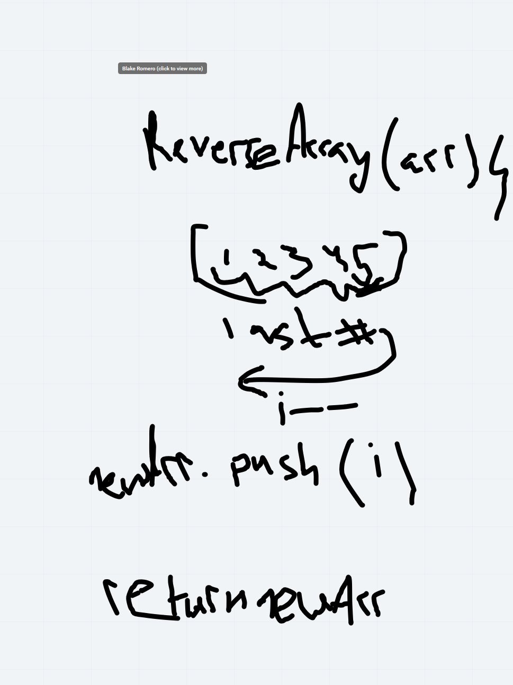
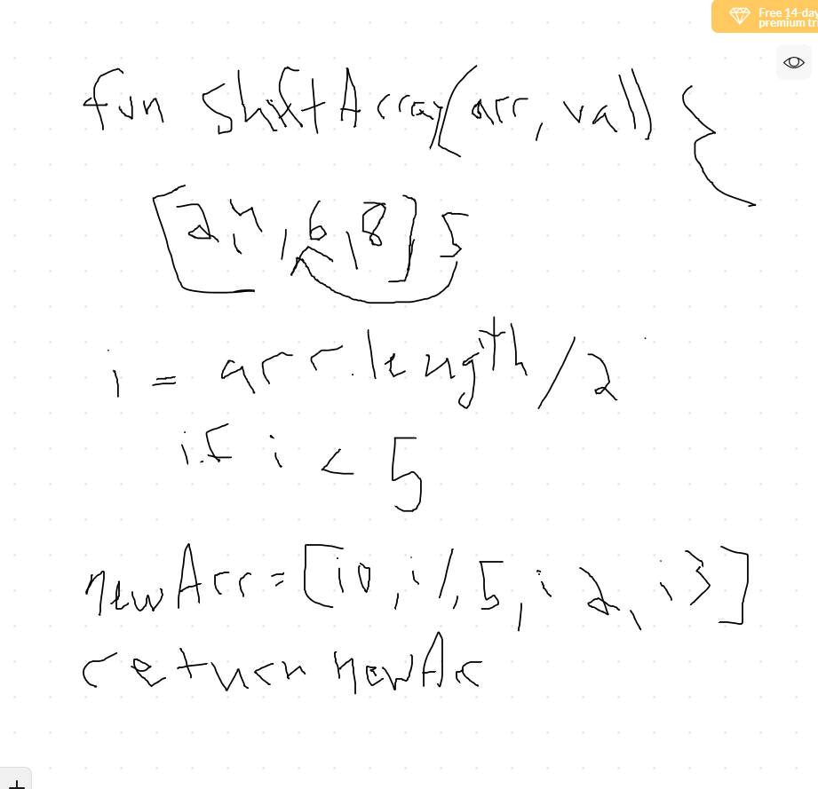
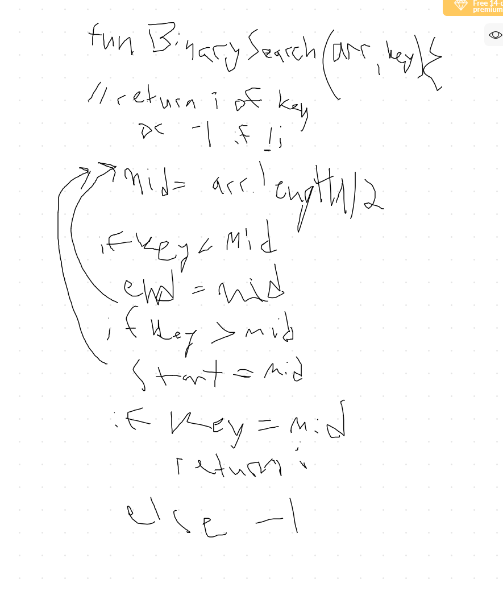

# data-structures-and-algorithms

## Reverse an Array
<!-- Short summary or background information -->
[challenge01](code-challenges/array-reverse/array-reverse.js)
Reverse the output of an array.

### Challenge
<!-- Description of the challenge -->
Create a function that takes in an array and outputs the array in reverse. Complete withoout the use of any built in methods.

### Approach & Efficiency
<!-- What approach did you take? Why? What is the Big O space/time for this approach? -->
The approach I took to this challenge is looking at the last number of the array and iterating through the array while counting down. Big O time is O(n)

### Solution
<!-- Embedded whiteboard image -->

## Shift Array
<!-- Short summary or background information -->
[challenge02](code-challenges/arrayShift/array-shift.js)
Shift an array and insert a number.

### Challenge
<!-- Description of the challenge -->
Create a function that takes in an array and a value and inserts it into the middle of the array.

### Approach & Efficiency
<!-- What approach did you take? Why? What is the Big O space/time for this approach? -->
The approach I took to this challenge is looking at the middle of an array, and assesing hwo to get to the middle. Using the length of an array and dividing it in half and comparing the answer to the position in the array. Then assign the new arrangement to a new array. Big O time is O(n)

### Solution
<!-- Embedded whiteboard image -->

### Solution
<!-- Embedded whiteboard image -->

## Shift Array
<!-- Short summary or background information -->
[challenge03](code-challenges/arrayBinarySearch/array-binary-search.js)
Shift an array and insert a number.

### Challenge
<!-- Description of the challenge -->
Create a function that takes in an array and a key value and checks the position in the array.

### Approach & Efficiency
<!-- What approach did you take? Why? What is the Big O space/time for this approach? -->
The approach I took to this challenge was a recursive approach at first, then I dropped in a while loop to iterate, setting the mid start and end to the array and recursively iterating the array. The time complexity is log(n)

### Solution
<!-- Embedded whiteboard image -->

